# Deploying a node.js application on AWS Ec2 instance

## Introduction

This project demonstrates how to host a Node.js application on an AWS EC2 instance.

Note: When deploying a Node.js application, you don’t need an additional web server—Node.js itself can act as the web server.

The steps are written in a simple way so that anyone can follow them easily. All you need is an EC2 instance, Node.js as the web server, and npm as the package manager.

## Requirements

1. AWS account with an EC2 instance (Linux-based)

2. SSH key pair to connect to the instance

3. Node.js and npm installed on EC2

4. Security group with HTTP (port 80) or app port open

5. Your Node.js application code.

## Deployment Steps:

### Step 1: Launch an EC2 Instance

Go to AWS Management Console --> EC2 --> Launch instance  (named as NodeApp)

Choose Amazon Linux AMI

Select instance type(t3.micro for free tier)

Configure security group --> Allow HTTP(80),HTTPS(443),SSH(22)

Click Launch Instance = Wait until the status shows running.

Creating and instance.

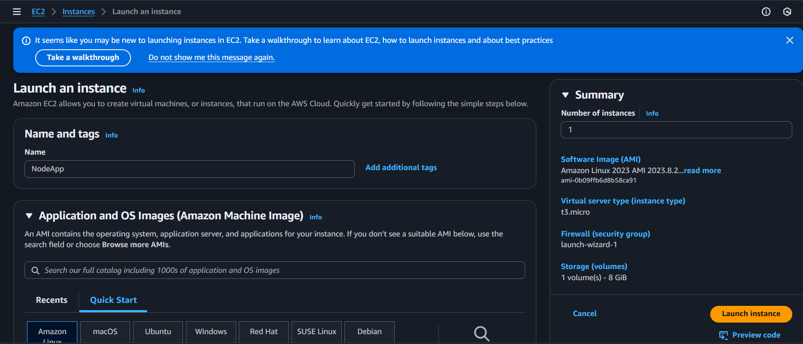

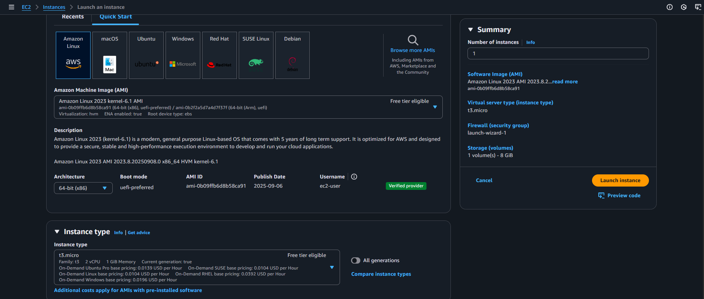

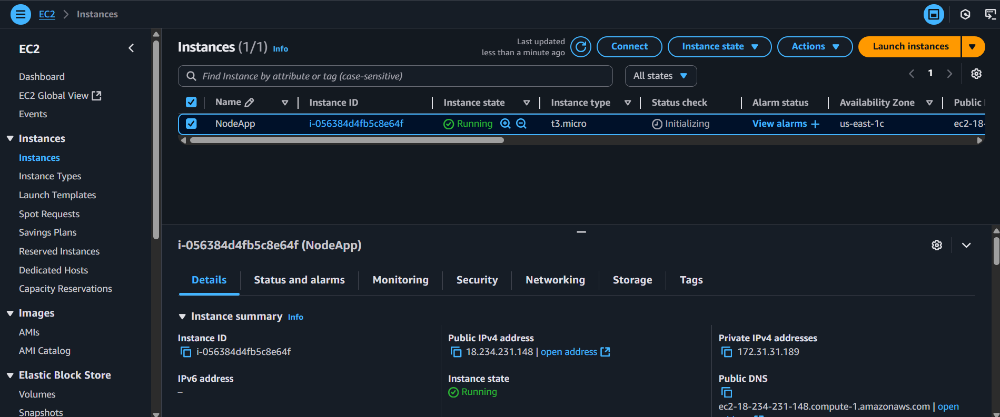

### Step 2: Connecting to EC2 instance

Run this command on terminal-

ssh -i "your-key-pem" ec2-user@your-public-ip

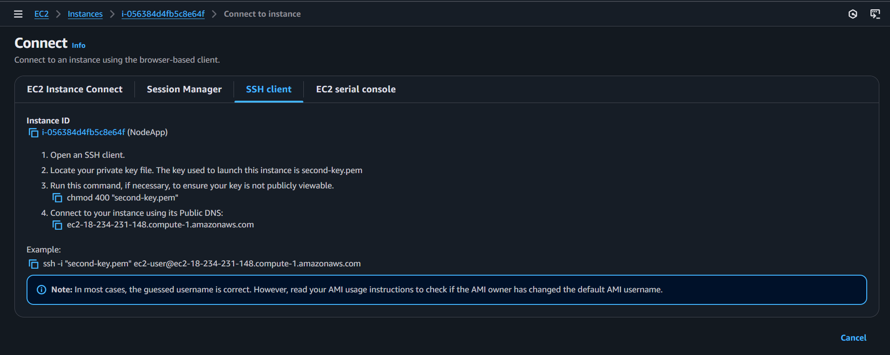

### Step 3: Updating Packages

Run this command on terminal-

sudo yum update

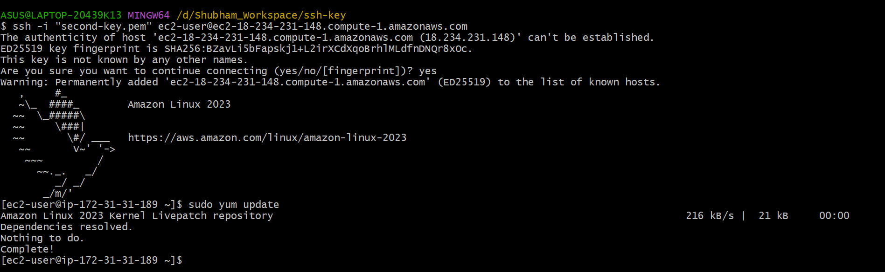

### Step 4: Installing Node.js as a webserver and NPM as a package manager

sudo yum install nodejs -y

sudo yum install npm -y

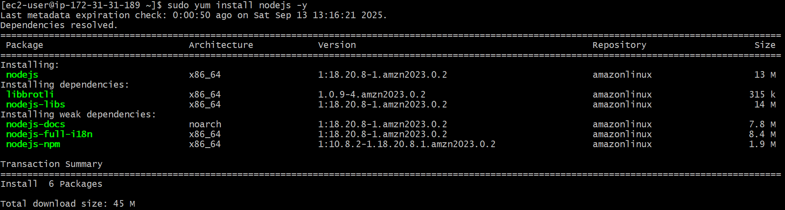

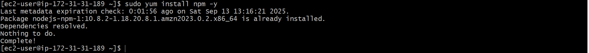

### Step 5: Check Versions
node --version

npm --version

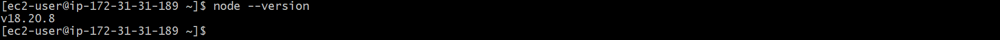

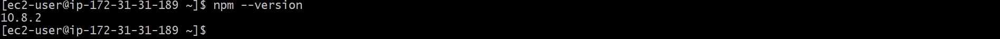

### Step 6: Create Directory

mkdir nodeapp

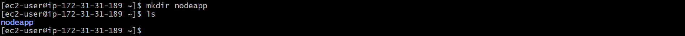

### Step 7: Verify Directory

ls

### Step 8: Go Inside Directory

cd nodeapp/

ls

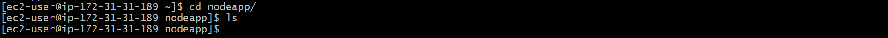

### Step 9: Check Git Installation

git --version

If not installed:

sudo yum install git

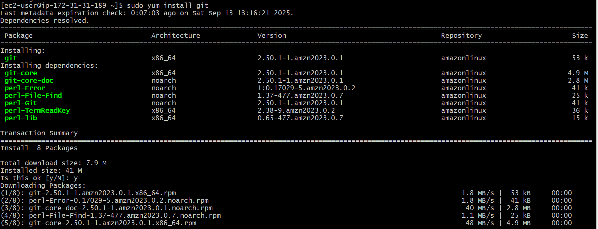

### Step 10: Check Git Version

git --version

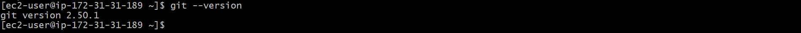

### Step 11: Clone Your Application Code

sudo git clone " your-repository-link"

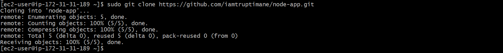

### Step 12: Go to Cloned Project

ls

cd node-app/

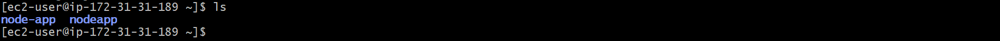

### Step 13: Verify Files

ls

### Step 14: Check for package.json and app.js

Ignore Dockerfile if present.

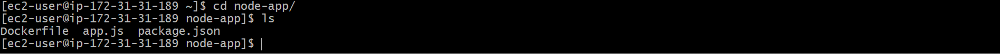

### Step 15: View package.json

cat package.json

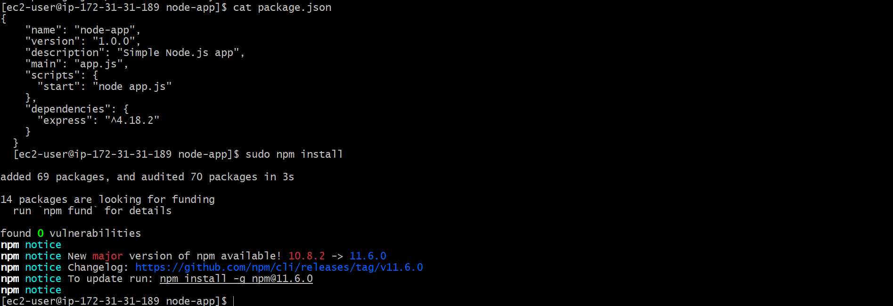

### Step 16: Install Dependencies

sudo npm install

### Step 17: Check node_modules Folder

If present, all dependencies are installed successfully.

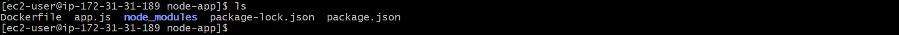

### Step 18: View app.js File

cat app.js

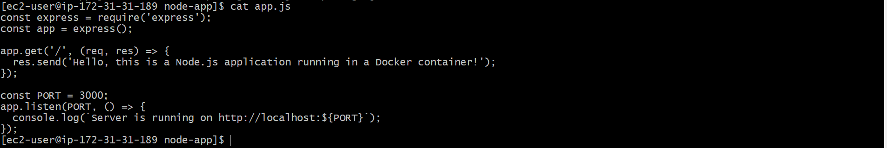

### Step 19: Run Application
node app.js

You should see:

Server is running...

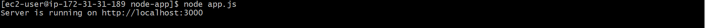

### Step 20: Configure Security Group

Go to AWS Security Group settings

Add a new inbound rule:

Type: Custom TCP

Port: 3000

Source: Anywhere (IPv4)

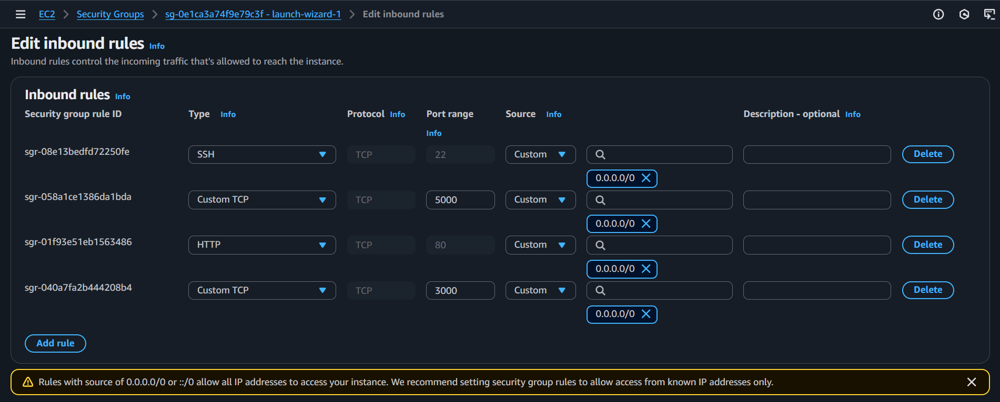

### Step 21: Access Application

Copy your EC2 Public IP and open it in browser with port 3000:

http://"public-ip":3000

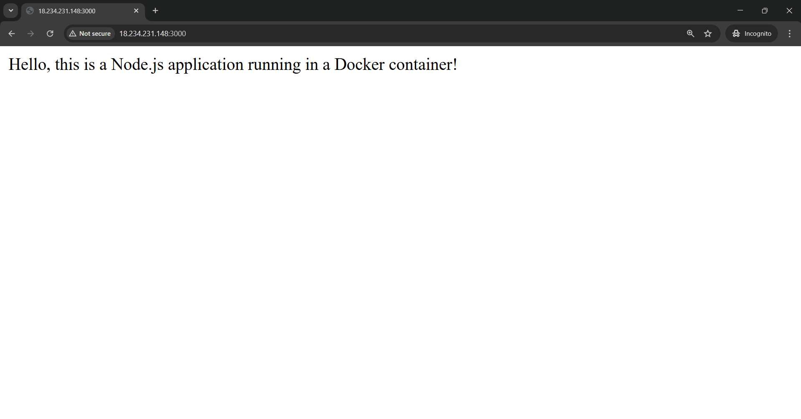

### Step 22: Run Application in Background (Optional)

If you want your app to keep running after closing the terminal:

sudo npm install -g pm2

pm2 start app.js

Now refresh your browser — your app will still be running.

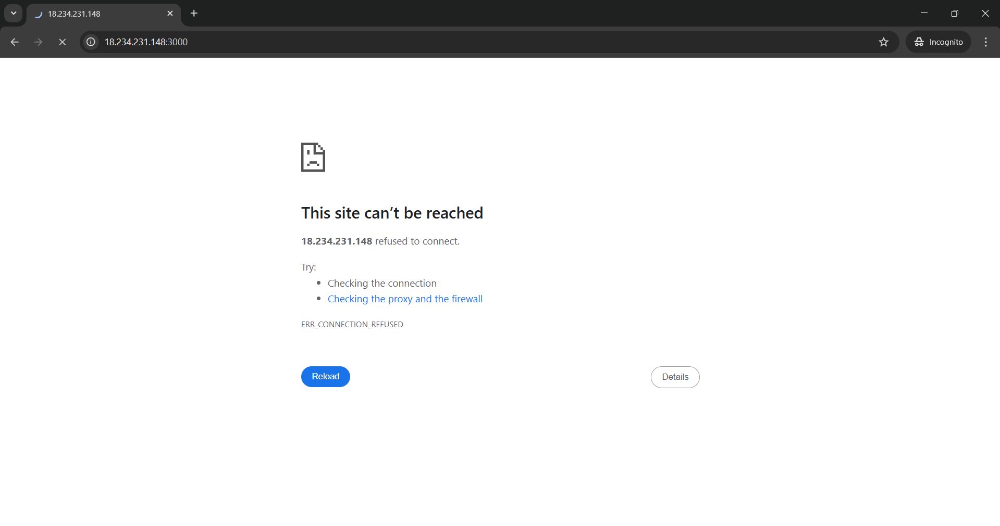

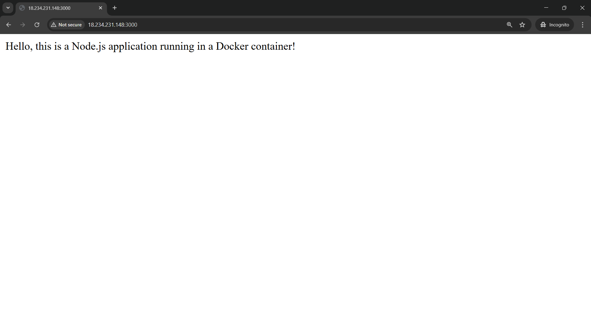

This is final output of your project.